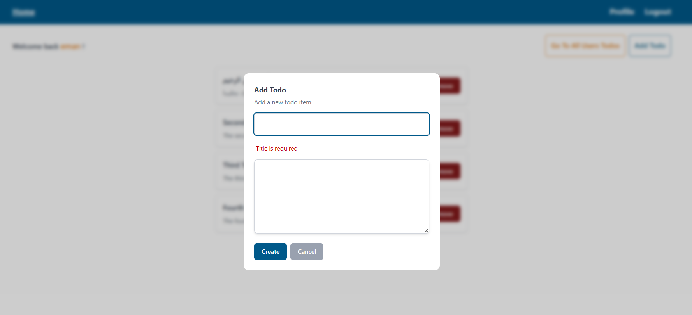
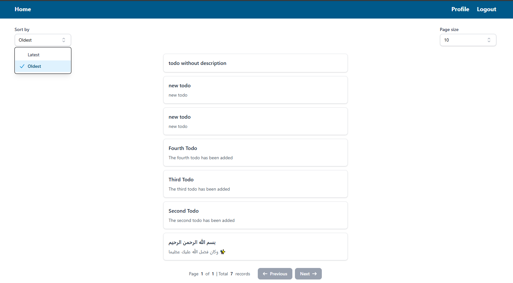

# Full-Stack Todo Application

A modern, full-featured todo application built with React 19 and TypeScript, featuring user authentication, CRUD operations, pagination, sorting, and responsive design.

---

<div align="center">
   <a href="https://drive.google.com/file/d/10SHhKFICF2e-5BCunj0n3F2GpjdvvLN1/view?usp=sharing" target="_blank">
      <span style="display:inline-block;margin-top:12px;padding:8px 20px;background:#2563eb;color:#fff;border-radius:6px;font-weight:600;font-size:1.1em;text-decoration:none;box-shadow:0 2px 8px #2563eb33;">🎥 Watch Demo Video</span>
   </a>
</div>

---

## Table of Contents

- [Backend API](#backend-api)
- [Usage](#usage)
- [Features](#features)
- [Tech Stack](#tech-stack)
- [Prerequisites](#prerequisites)
- [Installation](#installation)
- [Project Structure](#project-structure)
- [API Integration](#api-integration)
- [Authentication](#authentication)
- [Components](#components)
- [Contributing](#contributing)
- [Screenshots](#screenshots)

## ** Backend API **

This project connects to a backend powered by **Strapi v4** with SQLite as the database.

> To run your own backend locally:

1. Clone the [Strapi Backend Repo](https://github.com/emanmohamedsr/strapi-todo-db)
2. Follow the `README.md` there to start the server.
3. Once running, update your `.env` file in this frontend project with the correct backend URL.

## Usage

1. Make sure your Strapi backend is running at http://localhost:1337
2. Start the React frontend project
3. Register as a new user
4. Log in with your credentials
5. Create new todos
6. Edit or delete existing todos
7. Navigate, sort, and paginate all todo list

## Features

### Authentication System

- **User Registration** - Create new accounts with validation
- **User Login** - Secure login with JWT tokens
- **Protected Routes** - Route protection based on authentication status
- **Persistent Sessions** - LocalStorage-based session management
- **Auto Logout** - Secure logout functionality
- **Profile Management** - User profile viewing and management

### Todo Management

- **CRUD Operations** - Create, Read, Update, Delete todos
- **Real-time Updates** - Instant UI updates after operations
- **Modal Forms** - User-friendly modal dialogs for todo operations
- **Form Validation** - Comprehensive form validation with Yup
- **Error Handling** - Graceful error handling with user feedback

### Data Features

- **Pagination** - Navigate through todos with customizable page sizes
- **Sorting** - Sort todos by creation date (ASC/DESC)
- **Dynamic Page Sizes** - Choose from 5, 10, 50, or 100 items per page
- **Search & Filter** - Advanced todo filtering capabilities
- **Loading States** - Skeleton loaders for better UX

### UI/UX Features

- **Responsive Design** - Mobile-first, responsive across all devices
- **Modern UI** - Clean, intuitive interface with Tailwind CSS
- **Toast Notifications** - User feedback with react-hot-toast
- **Loading Skeletons** - Skeleton screens for better perceived performance
- **Error Boundaries** - Graceful error handling and recovery
- **Accessibility** - Built with accessibility best practices

### Developer Experience

- **TypeScript** - Full type safety throughout the application
- **ESLint** - Code linting and formatting
- **Custom Hooks** - Reusable React hooks for data fetching
- **Component Library** - Modular, reusable UI components
- **Hot Reload** - Fast development with Vite

## Tech Stack

### Frontend

- **React 19.1.0** - Latest React with concurrent features
- **TypeScript 5.8.3** - Type-safe JavaScript
- **Vite 7.0.4** - Next-generation frontend tooling
- **React Router Dom v6** - Client-side routing
- **Tailwind CSS 4.1.11** - Utility-first CSS framework

### State Management & Data Fetching

- **TanStack React Query 5.83.0** - Powerful data synchronization
- **Axios 1.10.0** - HTTP client for API requests
- **LocalStorage** - Client-side data persistence

### Forms & Validation

- **React Hook Form 7.60.0** - Performant forms with easy validation
- **Yup 1.6.1** - Schema validation library
- **@hookform/resolvers 5.1.1** - Form validation resolvers

### UI Components & Icons

- **Headless UI 2.2.6** - Unstyled, accessible UI components
- **Heroicons 2.2.0** - Beautiful hand-crafted SVG icons
- **React Hot Toast 2.5.2** - Smoking hot React notifications

### Development Tools

- **ESLint 9.30.1** - Code linting and quality
- **TypeScript ESLint 8.35.1** - TypeScript-specific linting
- **@faker-js/faker 9.9.0** - Generate fake data for testing

### Utility Libraries

- **class-variance-authority 0.7.1** - Class variance utility
- **tailwind-merge 3.3.1** - Merge Tailwind CSS classes
- **localforage 1.10.0** - Enhanced localStorage
- **match-sorter 8.0.3** - Simple, expected searching
- **sort-by 1.2.0** - Utility for sorting arrays

## Prerequisites

Before running this project, make sure you have:

- **Node.js** (v18.0.0 or higher)
- **npm** or **yarn** package manager

## Installation

1. **Clone the repository**

   ```bash
   git clone [your-repo-url]
   cd full-stack-todo-app
   ```

2. **Install dependencies**

   ```bash
   npm install
   # or
   yarn install
   ```

3. **Start the development server**

   ```bash
   npm run dev
   # or
   yarn dev
   ```

4. **Open your browser**
   Navigate to `http://localhost:5173`

### Key Features

- **Authentication**: Secure login/logout with JWT tokens
- **Todo Management**: Full CRUD operations with real-time updates
- **Pagination**: Navigate through large todo lists efficiently
- **Responsive Design**: Works seamlessly on all device sizes

## Project Structure

```
src/
| components/
│   ├── auth/
│   │   └── ProtectedRoute.tsx
│   ├── error/
│   │   └── ErrorHandler.tsx
│   ├── ui/
│   │   ├── Button.tsx
│   │   ├── Input.tsx
│   │   ├── Modal.tsx
│   │   ├── Paginator.tsx
│   │   ├── Select.tsx
│   │   └── Textarea.tsx
│   ├── ErrorMessage.tsx
│   ├── FakeTodo.tsx
│   ├── FakeTodos.tsx
│   ├── FakeTodoSkeleton.tsx
│   ├── FakeTodosPageSkeleton.tsx
│   ├── HomePageSkeleton.tsx
│   ├── Navbar.tsx
│   ├── Todo.tsx
│   ├── TodoForm.tsx
│   ├── Todos.tsx
│   └── TodoSkeleton.tsx
├── config/
│   └── axios.config.ts
├── data/
│   └── index.ts
├── hooks/
│   └── useCustomQuery.ts
├── interfaces/
│   └── index.ts
├── lib/
│   └── utils.ts
├── pages/
│   ├── FakeTodos.tsx
│   ├── index.tsx
│   ├── Layout.tsx
│   ├── Login.tsx
│   ├── Logout.tsx
│   ├── PageNotFound.tsx
│   ├── Profile.tsx
│   └── Register.tsx
├── router/
│   └── index.tsx
├── types/
│   └── index.ts
├── utils/
│   └── getUserData.ts
|── validation/
    └── index.ts
```

### Key Directories

- **`components/`** - Modular, reusable React components
- **`pages/`** - Top-level page components for each route
- **`hooks/`** - Custom React hooks for data fetching and state management
- **`validation/`** - Yup schemas for form validation
- **`config/`** - Application configuration (Axios, etc.)
- **`utils/`** - Helper functions and utilities

## API Integration

The application integrates with a REST API (Strapi-compatible) with the following endpoints:

- **Authentication**

  - `POST /auth/local` - User login
  - `POST /auth/local/register` - User registration

- **Todos**

  - `GET /users/me?populate=todos` - Get user's todos
  - `POST /todos` - Create new todo
  - `PUT /todos/:id` - Update todo
  - `DELETE /todos/:id` - Delete todo
  - `GET /todos` - Get paginated todos with sorting

- **User**
  - `GET /users/me` - Get current user profile

## Authentication

The application uses JWT-based authentication with:

- **Token Storage**: Secure storage in localStorage
- **Protected Routes**: Automatic redirection based on auth status
- **Token Validation**: Automatic token validation on API requests
- **Logout**: Secure token cleanup on logout

## Components

### Core Components

- **TodoForm** - Form for creating/editing todos
- **Todos** - Todo list display with actions
- **Paginator** - Pagination controls
- **Modal** - Reusable modal dialog
- **ProtectedRoute** - Authentication-based route protection

### UI Components

- **Button** - Styled button component
- **Input** - Form input with validation
- **Select** - Dropdown selection component
- **Textarea** - Multi-line text input

### Layout Components

- **Navbar** - Application navigation
- **Layout** - Page layout wrapper
- **ErrorHandler** - Global error boundary

## Scripts

- `npm run dev` - Start development server
- `npm run build` - Build for production
- `npm run lint` - Run ESLint
- `npm run preview` - Preview production build

## Contributing

1. Fork the repository
2. Create a feature branch (`git checkout -b feature/amazing-feature`)
3. Commit your changes (`git commit -m 'Add some amazing feature'`)
4. Push to the branch (`git push origin feature/amazing-feature`)
5. Open a Pull Request

## Acknowledgments

- React team for React 19
- Tailwind CSS for the utility-first CSS framework
- TanStack for React Query
- All the open-source contributors who made this project possible

---

## Screenshots

### Register Page


### Login Page


### Profile Page


### Logout Page


### Add Todo




### Edit Todo


### Delete Todo


### Show ALL Users Todos




**Built with ❤️ using React 19 and TypeScript**
